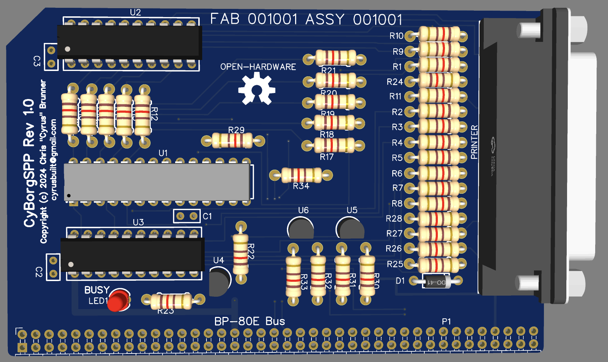

# CyBorgSPP
Standard Parallel (Printer) Port adapter for [CyBorg](https://github.com/cyrusbuilt/CyBorg).

This is the first add-on card for CyBorg. The goal of this board is to provide an at least *somewhat* [IEEE 1284](https://en.wikipedia.org/wiki/IEEE_1284)-compliant parallel port interface. This board is currently only intended to operate in SPP (a.k.a. "Centronics" or "Compatibility") mode though it is possible to support other modes in via firmware modification (such as Nibble Mode). This board does not have an onboard MCU or any firmware of its own but instead relies on host firmware support.

## Implementation
This board is actually one of a few possible implementations of a parallel port for CyBorg:

1) Using a [Z80 PIO Chip](http://www.z80.info/zip/z80piomn.pdf). This would be a more "conventional" approach.

2) Using the I/O expansion lines (pins 41-56) of CyBorg's BP-80E bus. Pros: Eliminates a bunch of extra circuitry and the need for the 3.3V rail and would not consume an I2C address. Cons: Once initialized, CyBorg's IOEXP chip (and therefore *all* of the I/O expansion lines) on CyBorg's bus would become dedicated to the parallel (printer) port, which could interfere with the operation of any other boards on the bus that rely on those pins. At least until CyBorg is rebooted. There is also no easy way to detect whether or not the card is installed.

3) Using the I2C bus and a separate MCP23017 chip in conjunction with the rest of the SPP circuitry. Pros: Eliminates the reliance on CyBorg's onboard IOEXP and therefore doesn't need any of those I/O pins, so there is no interference with their operation. This also easy to detect whether or not the card is installed. Cons: Currently uses a fixed I2C address of 0x21 which means no other I2C device on the bus can be configured to use that address. However, this *does* essentially make the device 'plug and play' because this address would be known to CyBorg's firmware and therefore make it easy to detect if the card is installed and configure it.

This board went with option 3. It's worth noting that options 2 and 3 are a less direct route to implementing a parallel port since there are some additional steps that have to be taken vs. using a PIO chip. However, the performance *should* still be on par.

## Theory of Operation
On boot, CyBorg's firmware checks to see if CyBorgSPP is installed, and if so, enables support for it. If enabled, the following OpCodes become avaialable:

- OP_SPP_WR_INIT (0x11): Initialize the board. This really only needs to be done *once* sometime after boot before using any other related OpCodes.

- OP_SPP_WR_WRITE (0x12): Sends a byte to the printer. It's worth noting that this operation doesn't check the READY status of the printer beforehand so you should read status first to determine that if needed.

- OP_SPP_RD_READ (0x8A): Reads the status of the printer.

When an application writes one of the supported OpCodes to the Z80 bus, ViCREM's Virtual I/O engine intercepts it and then sends the appropriate I2C transactions to CyBorgSPP to carry out the requested operation.

## Form Factor
This board is currently in an [RC2014](https://rc2014.co.uk/1377/module-template/) form-factor, though this is subject to change since CyBorg was designed to be ATX-compliant. CyBorgSPP's form-factor will likely change to something similar to an ISA or PCI card with mounting holes for the slot plate, etc.

## Firmware
Support for CyBorgSPP is built-in to CyBorg's firmware running on the [ViCREM](https://github.com/cyrusbuilt/CyBorg-Northbridge) chip.